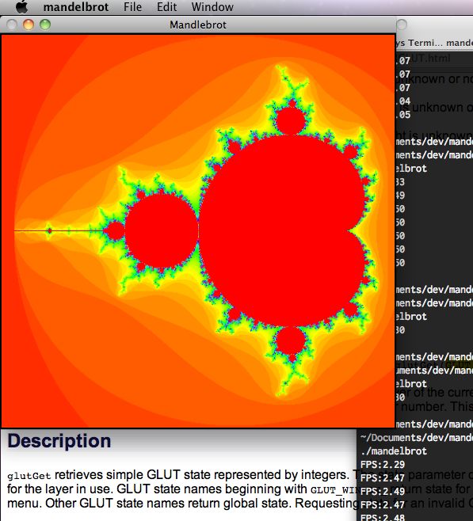

MandelbrotRenderer
==================

This is a bit of sample code I wrote in order to remind myself how to write assembly. My initial estimate was that it would take "one hour" to write in C and another to convert to assembly. The first part took an evening and the second... more like 10 hours! I'm going to attribute that to the fact I haven't used either FPU or 64 bit asm before (poor excuse).

The code is Intel x86_64 assembly, compiled with gcc on OS X 10.6 (Darwin 10.8) using the following line to compile:

g++ -g -o mandelbrot mandelbrot.cpp -framework Carbon -framework OpenGL -framework GLUT -fasm-blocks

Screenshot
=========

License
=======

This code is completely free to all for all purposes. No accrediation is required. 

References
==========

* Used NeHe Lesson 6 as a base http://nehe.gamedev.net/tutorial/texture_mapping/12038/
* x86_64 programmers reference http://www.intel.com/content/www/us/en/processors/architectures-software-developer-manuals.html
* GCC Inline Assembly guide http://www.ibiblio.org/gferg/ldp/GCC-Inline-Assembly-HOWTO.html
